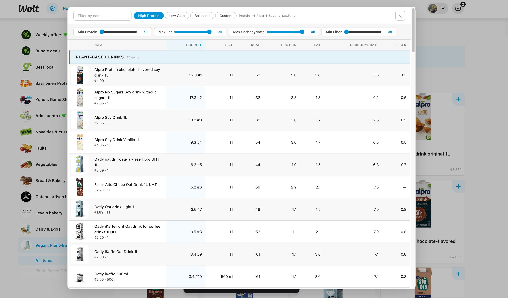

# Macros

A Chrome extension that adds a nutrition facts table to [Wolt Market](https://wolt.com) venue pages. Browse, sort, filter, and score grocery products by their nutritional values — right inside Wolt.

https://github.com/m-esm/macros/raw/main/demo.mp4



## Features

- **Nutrition table overlay** — sortable dark-themed modal showing nutrition data for all products in a category
- **Smart scoring** — rank products using built-in presets (High Protein, Low Carb, Balanced) or create a custom formula with adjustable nutrient weight sliders
- **Range filters** — set minimum protein/fiber and maximum fat/carbohydrate thresholds to narrow down products
- **Text search** — instantly filter products by name
- **Product thumbnails & prices** — see product images and prices alongside nutrition data
- **Click to open** — click any row to open the product detail on Wolt
- **SPA-aware** — automatically detects navigation between categories without page reload
- **Local caching** — product nutrition info is cached in localStorage for fast revisits

## Score Presets

| Preset | Strategy |
|--------|----------|
| **High Protein** | Protein ↑↑ Fiber ↑ Sugar ↓ Sat.Fat ↓ |
| **Low Carb** | Carbs ↓↓ Sugar ↓ Fat ↑ Protein ↑ |
| **Balanced** | Protein ↑ Fiber ↑ Sugar ↓ Sat.Fat ↓ Carbs ↓ |
| **Custom** | Adjust 6 nutrient weights from -5 to +5 |

## Installation

### From source (developer mode)

1. Clone this repository:
   ```bash
   git clone https://github.com/m-esm/macros.git
   cd macros
   ```

2. Open Chrome and navigate to `chrome://extensions`

3. Enable **Developer mode** (toggle in the top right)

4. Click **Load unpacked** and select the project root folder

5. Navigate to any Wolt Market venue page (e.g. [Wolt Market Vallila](https://wolt.com/en/fin/helsinki/venue/wolt-market-vallila/items/meijerituotteet-munat-100))

6. Click the **"Show nutrition table"** floating button to open the table

## How It Works

The extension consists of three parts:

1. **Fetch interceptor** (`injector.js`) — runs in the page's main JS context and intercepts Wolt's API calls to capture product category data as it loads

2. **Content script** (`content.js`) — runs in an isolated context, builds the nutrition table UI, fetches detailed product nutrition info, and handles all user interaction

3. **Background service worker** (`background.js`) — proxies nutrition data requests to `prodinfo.wolt.com` to work around CORS restrictions

## Tech Stack

- Vanilla JavaScript (no frameworks, no build step)
- Chrome Manifest V3
- CSS custom properties for theming

## Permissions

| Permission | Reason |
|-----------|--------|
| `storage` | Persist score preset and custom weight preferences |
| `https://wolt.com/*` | Inject content scripts on Wolt pages |
| `https://prodinfo.wolt.com/*` | Fetch product nutrition information |
| `https://consumer-api.wolt.com/*` | Fetch category product listings |

## Privacy

Macros does **not** collect, transmit, or store any personal data. All nutrition data is fetched directly from Wolt's public APIs and cached locally in your browser. No analytics, no tracking, no external servers.

## License

Free for personal, non-commercial use. See [LICENSE](LICENSE) for details.
